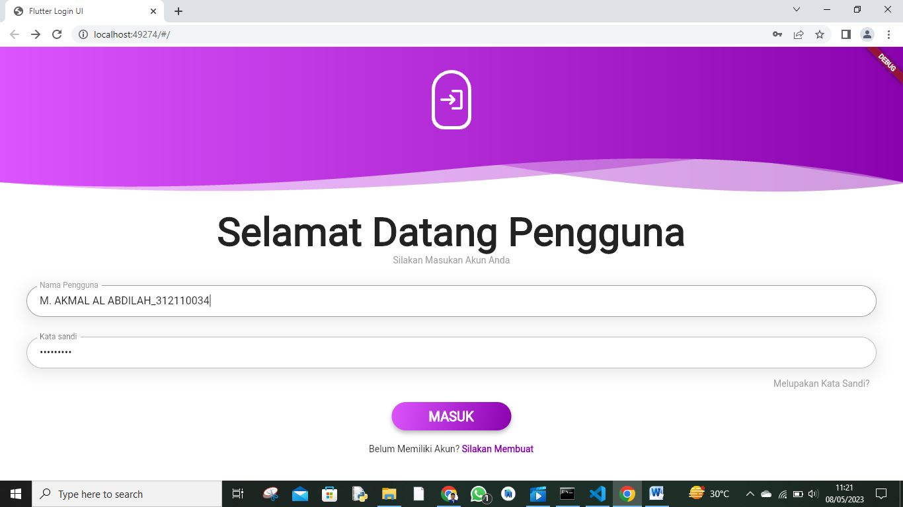
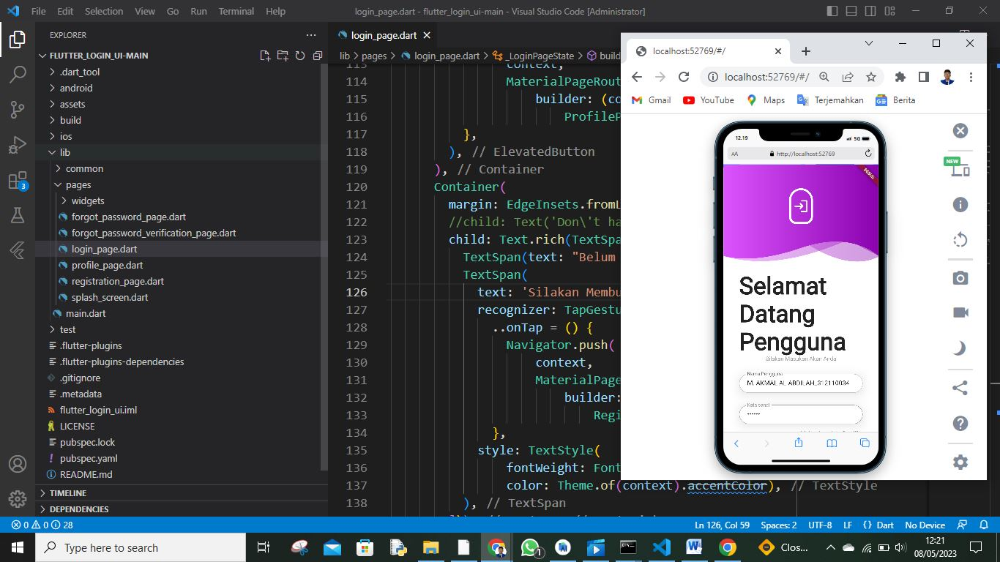
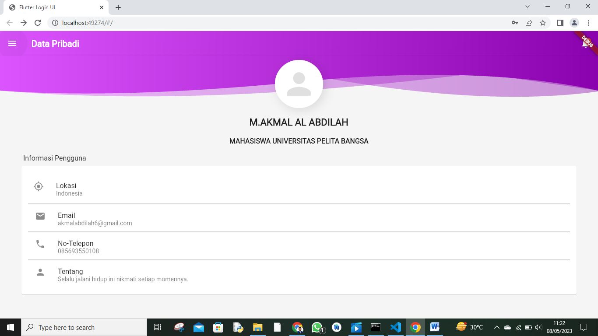
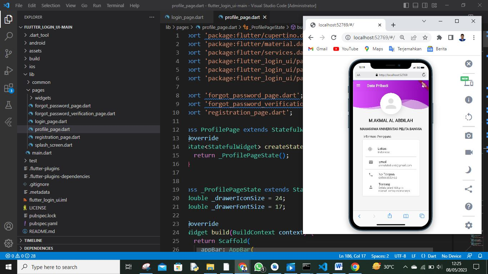
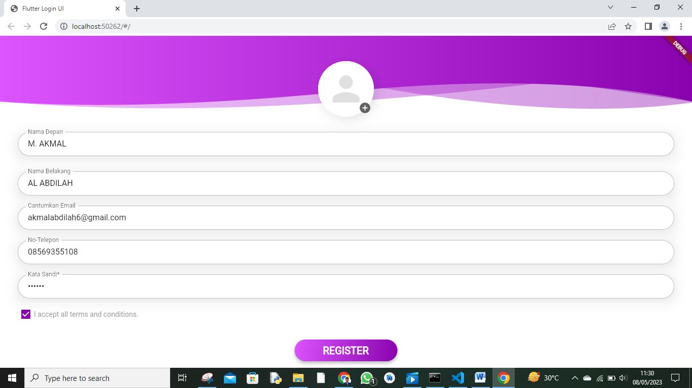
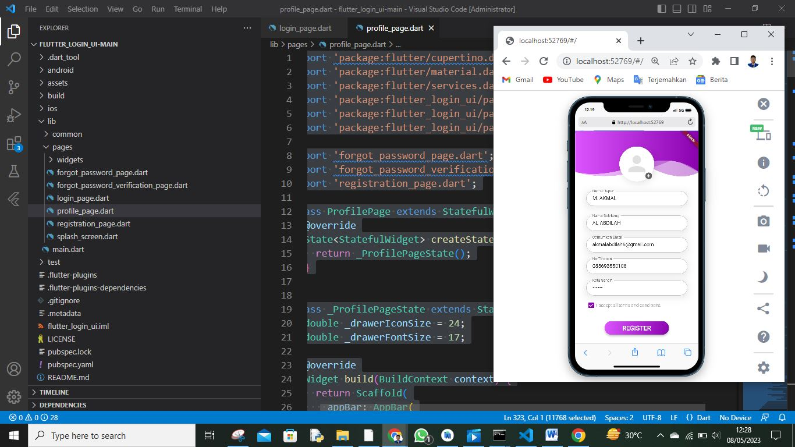
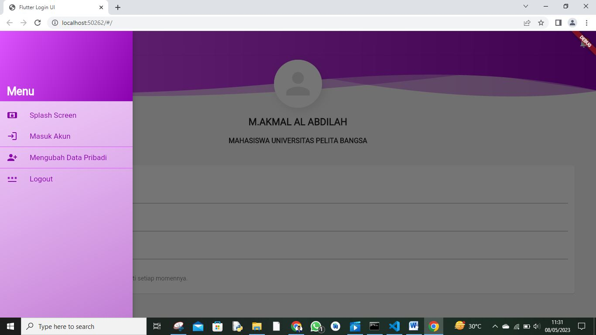

# UTS(Ujian Tengah Semester)

## Profil
| #               | Biodata                      |
| --------------- | ---------------------------- |
| **Nama**        | M. AKMAL AL ABDILAH          |
| **NIM**         | 312110034                    |
| **Kelas**       | TI.21.A.1                    |
| **Mata Kuliah** | Pemrograman Mobile 2         |

Login tampilan pc dan mobile

Data Pribadi tampilan pc dan mobile

Mengubah Data Pribadi tampilan pc dan mobile

Menu tampilan pc

Jadi kali ini saya hanya mengeksekusi kode aja jika kalian ingin penjelasan bisa cari di flatfom lain kurang lebi saya ucapkan!

